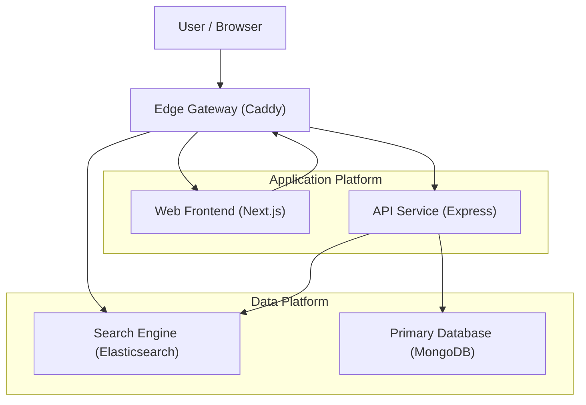

# Todo Application - Full Stack with MongoDB and Elasticsearch

A full-stack todo application built with Express.js backend, Next.js frontend, MongoDB, and Elasticsearch.

## Architecture

- **Backend**: Express.js server connecting to MongoDB and Elasticsearch
- **Frontend**: Next.js application that consumes backend API and connects directly to Elasticsearch for search
- **Database**: MongoDB for persistent storage
- **Search**: Elasticsearch for indexing and direct search from frontend



## Features

- Create todos and save to MongoDB or Elasticsearch
- View all todos from MongoDB (via backend API)
- View and search todos in Elasticsearch (direct connection from frontend)
- Real-time UI updates
- Error handling and loading states
- Responsive design

## Prerequisites

- Docker and Docker Compose
- Node.js 20+ (for local development)

## Quick Start with Docker Compose

1. Clone the repository and navigate to the project directory:
```bash
cd dummy
```

2. Start all services:
```bash
docker-compose up --build
```

This will start:
- MongoDB on port 27017
- Elasticsearch on port 9200
- Backend API on port 3001
- Frontend on port 3000

3. Open your browser and navigate to:
```
http://localhost:3000
```

## Local Development

### Backend

1. Navigate to the backend directory:
```bash
cd backend
```

2. Install dependencies:
```bash
npm install
```

3. Create a `.env` file (see `.env.example` for all available options):
```env
# Required
PORT=3001
MONGODB_URI=mongodb://localhost:27017/todos
ELASTICSEARCH_NODE=http://localhost:9200

# Optional (with defaults)
NODE_ENV=development
MONGODB_DB_NAME=todos
ELASTICSEARCH_INDEX=todos
ELASTICSEARCH_MAX_RETRIES=3
ELASTICSEARCH_REQUEST_TIMEOUT=30000
CORS_ORIGIN=*
CORS_CREDENTIALS=false
LOG_LEVEL=info
```

The backend uses a centralized **ConfigService** that loads configuration from environment variables with fallback to sensible defaults. See `backend/src/config/ConfigService.js` for details.

4. Start the server:
```bash
npm start
# or for development with auto-reload
npm run dev
```

### Frontend

1. Navigate to the frontend directory:
```bash
cd frontend
```

2. Install dependencies:
```bash
npm install
```

3. Create a `.env.local` file:
```env
NEXT_PUBLIC_API_URL=http://localhost:3001
NEXT_PUBLIC_ELASTICSEARCH_URL=http://localhost:9200
```

4. Start the development server:
```bash
npm run dev
```

5. Open [http://localhost:3000](http://localhost:3000) in your browser

## API Endpoints

### Backend API (http://localhost:3001)

- `POST /db` - Create a todo in MongoDB
  - Body: `{ "title": "string", "completed": boolean }`
  
- `GET /db` - Get all todos from MongoDB

- `POST /es` - Index a todo in Elasticsearch
  - Body: `{ "title": "string", "completed": boolean }`

- `GET /es` - Search todos in Elasticsearch (optional, frontend uses direct ES connection)
  - Query: `?q=searchterm`

- `GET /` - Health check endpoint

### Direct Elasticsearch Access

The frontend can directly query Elasticsearch at:
- `POST http://localhost:9200/todos/_search` - Search todos

## Project Structure

```
dummy/
├── frontend/          # Next.js application
├── backend/           # Express.js API
├── docker-compose.yml # Docker orchestration
└── README.md
```

## Environment Variables

### Backend

The backend uses a centralized `ConfigService` for managing all configuration. All variables have sensible defaults.

**Server Configuration:**
- `PORT` - Server port (default: `3001`)
- `NODE_ENV` - Environment mode: `development`, `production`, or `test` (default: `development`)

**MongoDB Configuration:**
- `MONGODB_URI` - MongoDB connection string (default: `mongodb://localhost:27017/todos`)
- `MONGODB_DB_NAME` - Database name (default: `todos`)

**Elasticsearch Configuration:**
- `ELASTICSEARCH_NODE` - Elasticsearch node URL (default: `http://localhost:9200`)
- `ELASTICSEARCH_INDEX` - Index name (default: `todos`)
- `ELASTICSEARCH_MAX_RETRIES` - Max connection retries (default: `3`)
- `ELASTICSEARCH_REQUEST_TIMEOUT` - Request timeout in ms (default: `30000`)

**CORS Configuration:**
- `CORS_ORIGIN` - Allowed origins (default: `*`)
- `CORS_CREDENTIALS` - Allow credentials (default: `false`)

**Logging Configuration:**
- `LOG_LEVEL` - Log level (default: `info`)

### Frontend
- `NEXT_PUBLIC_API_URL` - Backend API URL
- `NEXT_PUBLIC_ELASTICSEARCH_URL` - Elasticsearch URL for direct access

## Stopping Services

To stop all services:
```bash
docker-compose down
```

To stop and remove volumes (clears data):
```bash
docker-compose down -v
```

## Troubleshooting

### Elasticsearch CORS Issues
If you encounter CORS errors when the frontend tries to connect to Elasticsearch, ensure the Elasticsearch service has CORS enabled in `docker-compose.yml` (already configured).

### Port Conflicts
If ports 3000, 3001, 27017, or 9200 are already in use, modify the port mappings in `docker-compose.yml`.

### MongoDB Connection Issues
Ensure MongoDB is healthy before the backend starts. The health check in `docker-compose.yml` handles this.

## License

ISC

